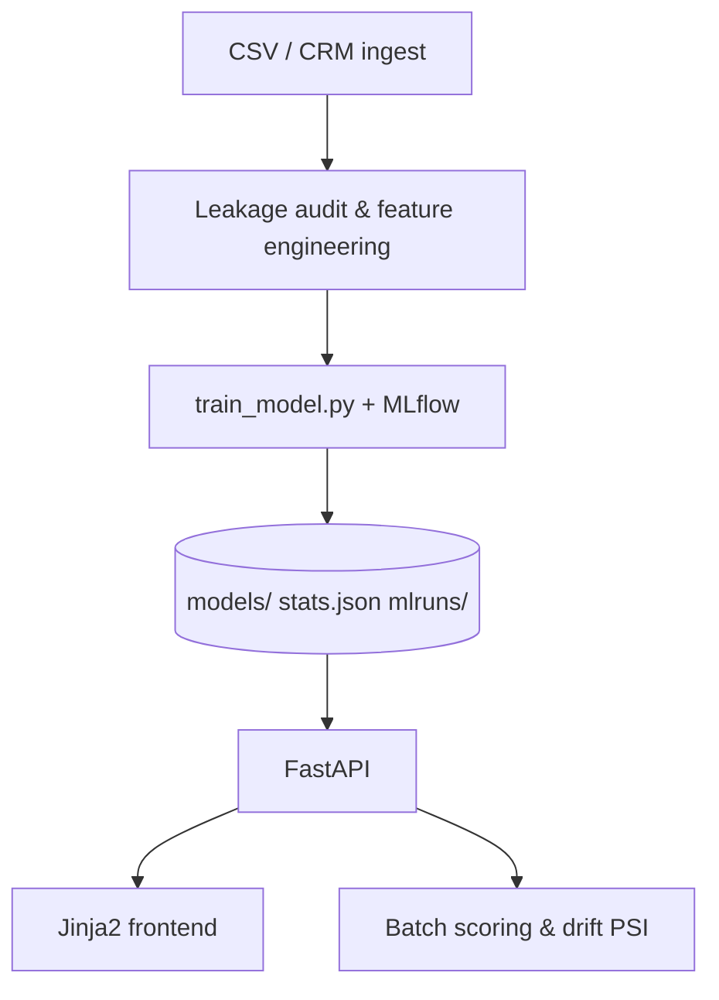

# ChurnGuard — Customer Churn Prediction


Minimal, premium SaaS-style churn prediction app built with **FastAPI**, **Jinja2**, and **scikit-learn**. Calm UI at first glance; depth via collapsible panels, MLflow experiments, and production-minded engineering.

<!-- GIF walkthrough: add docs/walkthrough.gif and embed here -->
<!--  -->

## Quick start

```bash
cd churn-app
pip install -r requirements.txt

cd ..
python train_model.py   # logs to MLflow + saves model version
cd churn-app

uvicorn app.main:app --reload --port 8000
```

Open **http://127.0.0.1:8000**

### MLflow UI

From the **ChurnPrediction** repo root:

```bash
mlflow ui --backend-store-uri mlruns --port 5001
```

Open **http://127.0.0.1:5001** to browse experiment runs, metrics, and artifacts.

### Admin routes

Set in `.env.local` (defaults: `admin` / `churnguard`):

```
ADMIN_USER=admin
ADMIN_PASSWORD=churnguard
```

Protected: `/retrain`, `/logs`, `POST /api/retrain-simulation`, `GET /api/logs`

Optional NL explanations: `OPENAI_API_KEY=sk-...`

## Deployment & model versioning

ChurnGuard runs as a standard FastAPI app — locally, in Docker, or behind nginx/ALB.

| Step | Action |
|------|--------|
| Train | `python train_model.py` from repo root → writes `models/`, `data/stats.json`, MLflow runs |
| Serve | `uvicorn app.main:app --host 0.0.0.0 --port 8000` from `churn-app/` |
| Promote | **Restart the process** after training so the new artifacts load (no hot-swap by default) |
| Version | History in `data/model_versions.json`; current version in `data/model_version.json` |

### Environment variables

| Variable | Required | Notes |
|----------|----------|-------|
| `ADMIN_USER` / `ADMIN_PASSWORD` | Recommended | Protects `/retrain`, `/logs`, retrain API |
| `CLERK_PUBLISHABLE_KEY` | Optional | UI auth (publishable key only in HTML meta) |
| `CLERK_SECRET_KEY` | Optional | Server-side only — never sent to the browser |
| `OPENAI_API_KEY` | Optional | NL explanations fallback to templates if unset |
| `SMTP_HOST` / `SMTP_USER` / `SMTP_PASSWORD` | Optional | Send executive PDF reports via email |
| `CORS_ORIGINS` | Production | Comma-separated allowed origins |

Replace `data/telco_churn.csv` with your CRM export for production scoring. The bundled Telco dataset is a public benchmark for demo/evaluation.

## Architecture



See `docs/design-decisions.md` and `docs/data-privacy.md`.

## Pages

| Route | Description |
|-------|-------------|
| `/` | Landing + demo video placeholder |
| `/predict` | Prediction + NL explanation + what-if |
| `/dashboard` | Analytics, drift, ROI, retention simulator |
| `/batch` | CSV batch prediction |
| `/insights` | Metrics, calibration, model version badge |
| `/experiments` | MLflow run history table |
| `/retrain` | Retrain simulation (admin) |
| `/logs` | Application logs (admin) |
| `/docs` | API reference + architecture diagram |
| `/about` | Case study + PDF executive summary |

## API highlights

- `POST /api/predict` — single customer (rate limited, sanitized)
- `POST /api/predict/explain` — NL summary of SHAP factors
- `POST /api/cohort-simulation` — retention impact projection
- `GET /api/experiments` — MLflow runs
- `GET /api/executive-summary.pdf` — downloadable summary
- All `/api/*` endpoints rate limited via slowapi

## Tests

```bash
cd churn-app
pytest tests/ -v
```

## Docker

From repo root:

```bash
docker build -f churn-app/Dockerfile -t churnguard .
docker run -p 8000:8000 -e ADMIN_PASSWORD=secret churnguard
```

## Project structure

```
ChurnPrediction/
├── train_model.py
├── ml/                  # leakage, calibration, MLflow, versioning
├── mlruns/              # MLflow tracking store
├── docs/                # design-decisions, data-privacy, audits
├── data/ models/
└── churn-app/
    ├── app/
    │   ├── observability/  # structured logging
    │   ├── auth/           # basic auth
    │   └── ml/             # inference, drift, NL explain
    └── tests/
```
